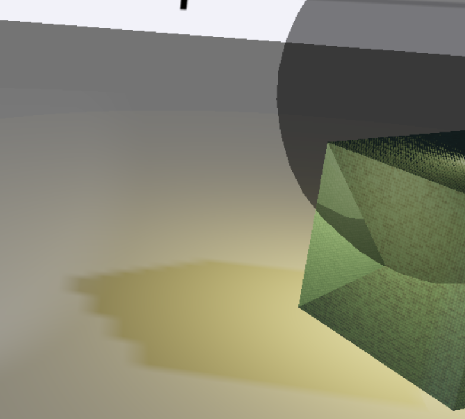
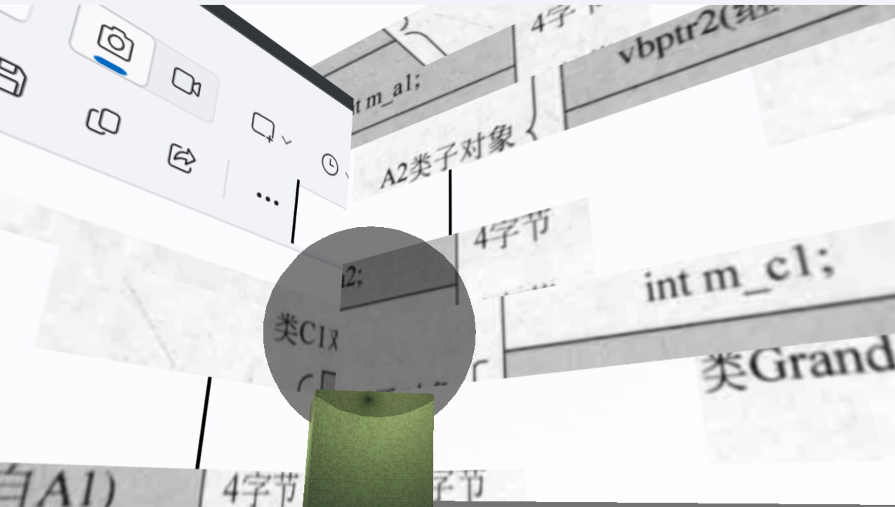
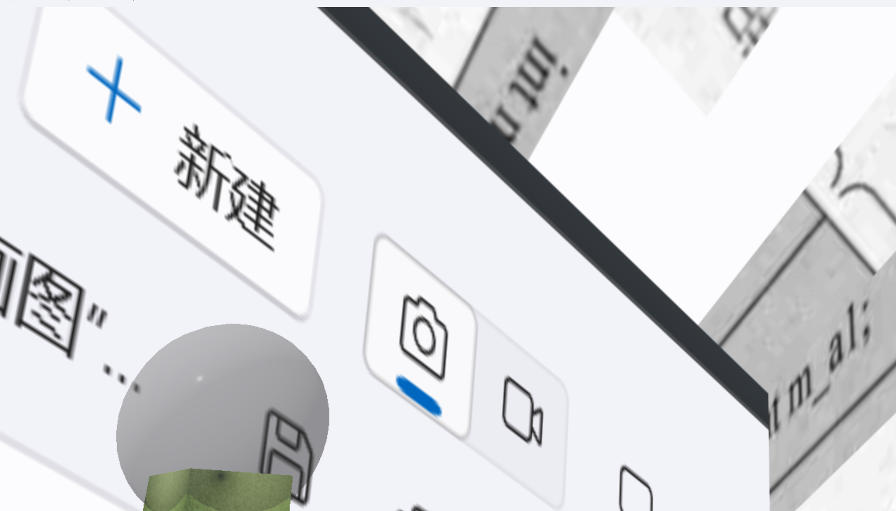
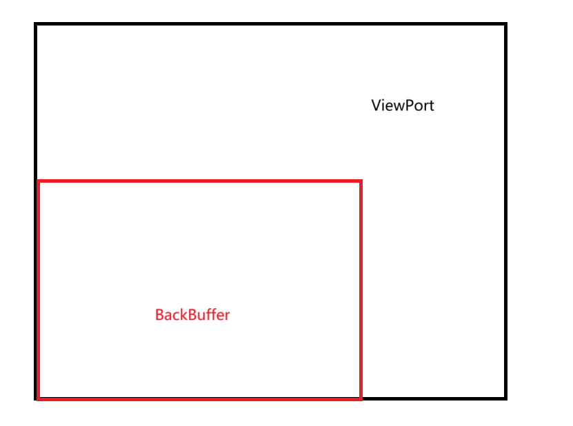
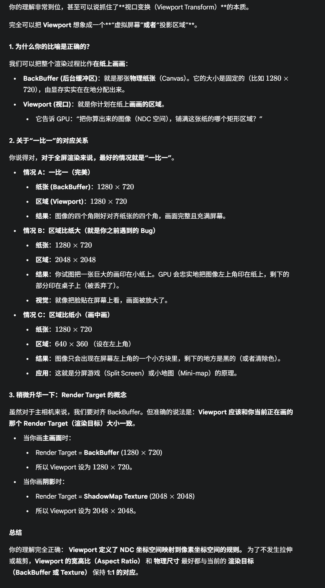
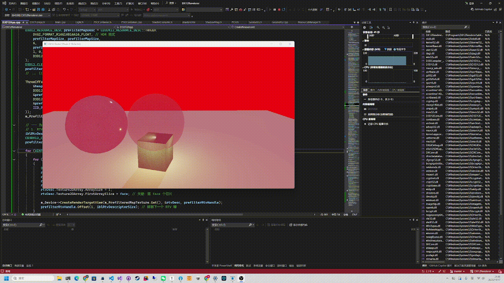

# 前言

Hi你好，如果有幸让你看到我的小项目，是我的荣幸，这是我使用DX12完成的一个小渲染器吧，会整理我实现各种功能的时候一些踩坑和心得，以及由此展开的一些图形学知识的再次学习。感谢你的阅读，期待Star和Issue。

# ShadowMap


总结一下实现：

需要两个Pass实现：（实际上就是用两个PSO），这两个PSO的根签名也不同，所以也需要两个根签名

## ShadowPass：

1. 在这个pass中，RTV是空的，因为我们并不关心这时候的渲染颜色，这个Pass绘制的东西也不会被SwapChain提交。

2. 这个pass中，是要绘制DSV。

   > 这里就涉及到我对于DX12的View/Descriptor和Resource设计的一个新的理解了：
   >
   > 简单来说Resource相当于是一种结构化的GPU内存上的数据，View是一个存储有烘焙数据的指向这个GPU的句柄。因此很自然的，可以有多个View指向同一个Resource。
   >
   > 这就可以在这里起到作用，我们两轮pass当中，会对同一个Resource操作：
   >
   > 1. ShadowPass会通过DSV向ComPtr\<ID3D12Resource\> m_ShadowMap写入深度数据。
   > 2. MainPass当中我们则会借助SRV把ComPtr\<ID3D12Resource\> m_ShadowMap当作是一个贴图从里面采样

3. 这里需要用到光源的MVP矩阵。我是把光源作为一个在旋转的方向光源，并且光源的投影矩阵我把它当作是正交投影来处理的。这里第一次使用光源的MVP矩阵的原因是，我们需要假设把摄像机（或者说是渲染平面）移动到光源的位置，然后计算深度，写入DSV指向的Resouce

## MainPass：

1. 绘制的主Pass，这个pass除了正常计算各个模型的MVP矩阵，来计算模型位置和变换之外，还要考虑阴影的计算。阴影的计算需要首先对把m_ShadowMap作为一个SRV进行采样。
2. 主MainPss的Shader需要额外计算一个顶点在光源坐标系下的位置：阴影采样代码是一个三步转换：`裁剪空间 -> NDC空间 -> UV空间`
   1. 通过VSMain当中，把顶点转换到光源的裁剪空间之后，再把它做了透视除法，就转换到NDC空间了` float3 lightNdc = input.lightSpacePos.xyz / input.lightSpacePos.w;`
   2. 然后我们知道，贴图的UV空间是\[0,1\]\[0,1\]的，因此我们只需要做一次Y轴反转缩放+X轴缩放到0，1就可以映射到UV空间采样了
   3. 同时，除了x，y之外，lightNdc.z当中，存储的就是一个vertex，在光源坐标系下的深度值，这个值要和阴影贴图当中采样出的结果来比较：物理的含义是，在光源视角下，可能会有很多点，投影后的x，y是一样的，但是深度不同，只有最贴近光源（深度最小的）才能有光照
3. `shadowFactor = g_ShadowMap.SampleCmp(g_SamplerCmp, shadowTexCoord, fragmentDepth);`,g_SamplerCmp这个sampler在定义的时候，定义了它的比较函数

```c++
    // Sampler 1: 用于阴影贴图 (比较采样器)
    D3D12_STATIC_SAMPLER_DESC shadowSampler = {};
    shadowSampler.Filter = D3D12_FILTER_COMPARISON_MIN_MAG_LINEAR_MIP_POINT; // 比较过滤器
    shadowSampler.AddressU = D3D12_TEXTURE_ADDRESS_MODE_BORDER; // 超出范围的区域按 1.0 处理 (不在阴影中)
    shadowSampler.AddressV = D3D12_TEXTURE_ADDRESS_MODE_BORDER;
    shadowSampler.AddressW = D3D12_TEXTURE_ADDRESS_MODE_BORDER;
    shadowSampler.BorderColor = D3D12_STATIC_BORDER_COLOR_OPAQUE_WHITE;
    shadowSampler.ComparisonFunc = D3D12_COMPARISON_FUNC_LESS_EQUAL; //比较函数
    shadowSampler.ShaderRegister = 1; // s1
    shadowSampler.RegisterSpace = 0;
    shadowSampler.ShaderVisibility = D3D12_SHADER_VISIBILITY_PIXEL;
    D3D12_STATIC_SAMPLER_DESC samplers[] = { textureSampler, shadowSampler };
```

### 上面值得注意的是*比较过滤器*和*比较函数*


这实际上是实现**柔和阴影边缘PCF**用的，也就是计算出来的shadowFactor是一个百分比，意思是通过四个临近点采样的均值来计算在阴影中的百分比


```c++
// 主通道 - 顶点着色器
PSInput VSMain(VSInput input)
{
    PSInput output;
    
    // 转换到摄像机裁剪空间 (用于光栅化)
    output.position = mul(wvpMatrix, float4(input.position, 1.0f));
    
    // 转换到光源裁剪空间 (用于阴影采样)
    output.lightSpacePos = mul(lightWvpMatrix, float4(input.position, 1.0f));

    //传递其他数据
    output.color = input.color;
    output.texcoord = input.texcoord;

    return output;
}


// 主通道 - 像素着色器
float4 PSMain(PSInput input) : SV_Target
{
    // 获取基础颜色
    float4 baseColor = input.color;
    if (textureInfo.x == 1.0f)
    {
        //采样贴图
        baseColor = g_Texture.Sample(g_SamplerLinear, input.texcoord);
    }
    else
    {
        // 使用顶点颜色
        baseColor = input.color;
    }

    // 计算阴影
    float shadowFactor = 1.0;

    float3 lightNdc = input.lightSpacePos.xyz / input.lightSpacePos.w;
    float2 shadowTexCoord;
    shadowTexCoord.x = 0.5f * lightNdc.x + 0.5f;
    shadowTexCoord.y = -0.5f * lightNdc.y + 0.5f;
    float fragmentDepth = lightNdc.z;
    
    shadowFactor = g_ShadowMap.SampleCmp(g_SamplerCmp, shadowTexCoord, fragmentDepth);

    if (saturate(shadowTexCoord.x) != shadowTexCoord.x || saturate(shadowTexCoord.y) != shadowTexCoord.y)
    {
        shadowFactor = 1.0;
    }


    // 组合最终颜色
    //    这可以确保即使物体处于阴影中 (shadowFactor = 0.0)，
    float3 ambientLight = float3(0.2f, 0.2f, 0.2f); // 20% 的基础亮度

    // - 被照亮时: (0.2 + 1.0) * baseColor -> 超过 1.0
    // - 在阴影时: (0.2 + 0.0) * baseColor -> 0.2 * baseColor (深灰色)
    float3 finalColor = baseColor.rgb * (ambientLight + shadowFactor);
    
    // 使用 saturate() 来防止颜色过曝
    finalColor = saturate(finalColor);

    return float4(finalColor, baseColor.a);
}
```

我让AI总结了下上面的流程：


## ShadowMap分辨率

我的窗口大小设置的是1024x1204，但是我的ShadowPass的视口设置的是2048x2048

如果我用256x256的分辨率，就会使这样的效果m_ShadowMap = std::make_unique\<ShadowMap\>(m_Device.Get(), 2048, 2048);




其实就是单一纹素对应多个像素的问题。增大阴影贴图的采样大小可以很好的缓解锯齿问题，在要不然就开MipMap

如果阴影贴图分辨率太小了，那么MainPass渲染阴影的时候，就很可能会出现多个像素最后落在同一个纹素的情况，我这里还开了PCF，但是锯齿还是很严重

# 多物体渲染


还是这张图

这里还需要关注的是，我实现了两种不同的贴图效果：地面用的是白色，但是box用的是在贴图上采样

有两种做法：

最直观的一种是，我们认为每一种贴图对应一个PSO，因此两个PSO+独立的ConstBuffer就可以完成这点

但是显然，这俩的Vertex定义都是一样的，所以RootSignature也是一样的，区别是：

1. 使用的贴图不同 
2. 使用的matrix不同

我才用的方法是，使用同一个PSO，分多次绘制，每次绘制都绑定一次IA，第一次绘制的时候绑定Box 的IA，第二次绑定Planet的IA。然后使用哪种贴图则是在ConstBuffer当中开了一个标记位，用这个标记位来标记当前是使用白色渲染还是使用贴图采样：

```c++
// 主通道 - 像素着色器
float4 PSMain(PSInput input) : SV_Target
{
    // 获取基础颜色
    float4 baseColor = input.color;
    if (textureInfo.x == 1.0f)
    {
        //采样贴图
        baseColor = g_Texture.Sample(g_SamplerLinear, input.texcoord);
    }
    else
    {
        // 使用顶点颜色
        baseColor = input.color;
    }

```

### CPUGPU顺序问题

但这里有个坑，就是如何管理这个ConstBuffer。

一开始我的做法是用一个Constbuffer，然后每次**录制绘制操作前**，给常量缓冲区值赋值。但这样是有严重问题的：因为，CPU和GPU并不同步。

我们使用CommandList的时候，只是在录制指令，这个指令并没有执行，并且，这个指令也是需要GPU来执行的。然而，赋值这个操作都是在CPU执行的，这俩根本就不同步，所以当第二次赋值的时候，实际上覆盖了第一次赋值。具体的流程如下：

> 第一次给ConstBuffer赋值 -> 第二次给Constbuffer赋值 -> Box的IA绑定，绘制等在GPU执行 -> Planet的IA绑定，绘制等在GPU执行


这个流程根本就不同步。解决方法是，我们要开一个足够大的ConstBuffer，也就是Const的这个Resource是要能容纳多个模型的Matrix（或者说常量资源的），然后赋值的时候，要对每个资源的偏移赋值


# 多光源


# PBR

先说一下对于PBR的理解

PBR的光照计算分为两部分：镜面反射+漫反射。而漫反射则是基于能量守恒从 1- F项的

镜面反射则是基于D，G和F这三个项的计算

用一个比喻

> 想象一下，你（摄像机 V）在看一个体育场，太阳（光源 L）在你身后。体育场里坐满了**100万个**拿着**小镜子**的人（微表面）。

###  D 项 (Distribution) - “有多少镜子对准了？”

- **它回答的问题：** 在这100万人中，有多少人的镜子**恰好**对准了能把太阳（L）反射给你（V）的那个完美角度（H向量）？
- **这取决于粗糙度(Roughness)：**
  - **光滑表面 (如镜子)**：`Roughness = 0`。体育场纪律严明，**所有100万人**都把镜子对准了**同一个方向**。`D`项的值在那个方向上是一个**极大**的数（这就是为什么`D`项可以大于1，它不是百分比，是*浓度*）。
  - **粗糙表面 (如毛玻璃)**：`Roughness = 1`。体育场里乱作一团，人们的镜子朝向各不相同。可能**只有1000人**恰好对准了你。`D`项的值很小，但分布很广。

**D项 是在计算“有多少微表面（人）在参与反射”。**

### G 项 (Geometry) - “有多少对准的镜子没被挡住？”

- **它回答的问题：** 在那些**已经对准了你**的人（由`D`项选出）中，有多少人**没有**被前一排的人（其他微表面）挡住？
- **这取决于你观察的角度：**
  - **垂直观察 (V ≈ N)**：你从体育场正上方往下看，几乎**没人**被挡住。`G`项 ≈ 1.0。
  - **侧面掠射 (V ≈ 90度)**：你从体育场侧面看台的边缘看过去，**绝大多数**对准你的人都被他们前排的人挡住了。`G`项 ≈ 0.0。

**G项 是在计算“参与反射的人中，有多少是可见的”。**

###  F 项 (Fresnel) - “镜子本身的反射率是多少？”

- **它回答的问题：** OK，现在我们有了一群**对准了**（D）并且**没被挡住**（G）的人。最后一步是，他们手里拿的小镜子**本身**（材质物理特性）能反射**百分之多少**的光？
- **这取决于观察角度和材质：**
  - 菲涅尔效应说，光线以不同角度照射在“空气-镜子”这个界面时，反射的比例是不同的。
  - 比如，他们拿的是非金属（塑料镜子）。你垂直看，它只反射 4%（`F0`）。你从侧面看，它反射 100%。

**F项 是在计算“单一微表面（镜子）的物理反射比例”**

`F` 是**材质的物理特性**。（镜子是金的还是塑料的？）

`D` 和 `G` 是**表面的几何特性**。（这群人坐得是整齐还是混乱？你从哪个角度看他们？）

## 总结

或者说，我认为DGF这三个项从逻辑上时依次进行的

我们现在知道，我从一个方向观察，如果我要接收到这个方向的光，那么就一定要是存在一个平面，它的平面方向（法线）一定要是正好能让出射光反射到我的眼睛里，那么这个平面法线就必须是入射和出射光的半程向量（h）


当加入了微表面的原理之后，我们就能想到，当我从一个角度观察一个平面，那么就一定存在一束光（这个光并不是一条光线，而是很多光线的集合），照在这个平面上，那么就一定要有**正好平面法线等于h的微平面**

D项回应的就是，到底有多少这个数量或者比例的微平面

有了D项的基础，微平面还存在自遮挡现象，也就是有的微平面会遮挡其他平面。这个现象也和h有关系，所以G项回应的就是，从这个角度观察，有多少会自遮挡。

`D * G` 得到的是 **在几何上，有多少微平面（的面积）准备好了将光线 L 反射到 V**

接下来要解决的就是**在这个微表面材质，当入射光入射之后，有多少会被反射，有多少会进入物体内部变成漫反射（F0）**，这个问题和物体的材质（F0）以及观察角度都有关系，所以，这是一个**物理问题**、

> 菲涅尔效应: 任何材质的反射率，都会随着观察角度的变化而变化。
>
> 为啥观察角度会决定反射率呢，因为当我从一个角度观察的时候，就决定了只有特定角度的入射光才能传到我的眼睛里，从而这部分入射的角度不同会导致不同的反射率的反射
>
> 


# 摩尔纹


方法就是各向异性，对于DX12来说就是直接改Sampler

```c++
// D3D12App::CreateRootSignature 函数
void D3D12App::CreateRootSignature()
{
...
    //Sampler 0: 用于主纹理
    D3D12_STATIC_SAMPLER_DESC textureSampler = {};
    
    // **  升级为各向异性过滤 **
    textureSampler.Filter = D3D12_FILTER_ANISOTROPIC; // <-- 从 MIN_MAG_MIP_LINEAR 修改
    
    textureSampler.AddressU = D3D12_TEXTURE_ADDRESS_MODE_WRAP;
    textureSampler.AddressV = D3D12_TEXTURE_ADDRESS_MODE_WRAP;
    textureSampler.AddressW = D3D12_TEXTURE_ADDRESS_MODE_WRAP;

    textureSampler.MinLOD = 0;
    textureSampler.MaxLOD = D3D12_FLOAT32_MAX;
    textureSampler.ShaderRegister = 0;//s0
    textureSampler.RegisterSpace = 0;
    textureSampler.ShaderVisibility = D3D12_SHADER_VISIBILITY_PIXEL;

    // ** 新增: 设置各向异性过滤的级别 (16x 是高质量) **
    textureSampler.MaxAnisotropy = 16; 


    // Sampler 1: 用于阴影贴图 (比较采样器)
    D3D12_STATIC_SAMPLER_DESC shadowSampler = {};
...
```

然后我发现还是很严重。。


## MIpMap

原来是缺少了MipMap。DX12要手动的创建MipMap


其实这个问题可以用DX12的接口来做，但是我用的CPU的MipMap。实际上就是在CPU提前创建好所有的MipMap的子对象和他的图片，然后作为SubResource，创建Resource的时候直接创建好。

> DX12中，Resouce就是由SubResouce组成的，只是如果不指定的话，就是存在第0个位置
>
> 

这里要注意的是，第一MipMap的计算方法：我们最后的目的是要让最远的时候就是一个像素，每次都是切一半，所以他是一个log2N的规模缩小，知道变成长宽只有一个像素大小。因此：

> ```c++
> int maxDim = max(textureWidth, textureHeight);
> UINT mipLevels = 1 + (UINT)floor(log2(maxDim)); // 1 + log2(max)
> ```

核心降采样用的是stbir_resize_uint8_srgb这个接口，这个接口考虑了非线性的色彩空间，大概的计算逻辑是：`ToLinear(sRGB_A) + ToLinear(sRGB_B)` -> 多相滤波-> `ToSRGB(result)(这个转换约等于pow(pixel_linear, 1.0/2.2))`

> `stb_image_resize` (stbir) 是一个高质量的图像缩放库，它在缩放时（尤其是降采样）使用的是**高质量的多相滤波 (High-Quality Polyphase Filtering)**。
>
> - **什么是多相滤波？** 当你从 2048x2048 缩放到 1024x1024 时 (生成Mip 1)，Box降采样只会查看源图像上一个 2x2 的像素块。
> - `stbir` 使用的默认滤波器（例如 Mitchell-Netravali 或 Catmull-Rom）会查看一个**更大的采样核 (Kernel)**，比如 4x4 或 6x6 的源像素，并应用一个复杂的加权平均。
> - **为什么这样做？** 这样可以**极大地减少锯齿 (Aliasing)** 并保留更多的图像细节，使纹理在远处看起来更平滑、更清晰，而不会闪烁。
>
> 

```c++
void D3D12App::GenerateMipMap(void* pData, int textureWidth, 
    int textureHeight, int mipMapLevels, 
    std::vector<stbi_uc*>& mipDataBuffers,
    int texturePixelSize = 4) {
    stbi_uc* pTextureData = (stbi_uc *) (pData);
    mipDataBuffers.push_back(pTextureData); //mipMap0;
    int curWidth = textureWidth;
    int curHeight = textureHeight;
    for (int i = 1; i < mipMapLevels; ++i) {
        int mipWidth = textureWidth >> i;
        int mipHeight = textureHeight >> i;
        stbi_uc* pMipData = (stbi_uc*)malloc(mipWidth * mipHeight * texturePixelSize);
        if (pMipData == nullptr) { throw std::runtime_error("Failed to allocate memory for Mipmap"); }

        mipDataBuffers.push_back(pMipData);
        // 计算步长 (stride)
        // 0 表示使用默认的 (width * 4)
        int input_stride_bytes = 0;
        int output_stride_bytes = 0;
        stbir_resize_uint8_srgb(
            mipDataBuffers[i - 1], textureWidth >> i-1, textureHeight >> i-1, 0, // Source
            pMipData, mipWidth, mipHeight, 0,                      // Dest
            STBIR_RGBA
        );
    }
}
```


```c++
void D3D12App::LoadTextureFromFile(
    const char* filename, 
    ComPtr<ID3D12Resource>& textureResource, 
    D3D12_CPU_DESCRIPTOR_HANDLE srvHandle)
{
    int textureWidth, textureHeight, textureChannels;
    //第0级MipMap
    stbi_uc* pTextureData = stbi_load(filename, &textureWidth, &textureHeight, &textureChannels, STBI_rgb_alpha);
    if (pTextureData == nullptr) {
        std::string errorMsg = "Failed to load texture file: ";
        errorMsg += filename;
        throw std::runtime_error(errorMsg);
    }
    UINT texturePixelSize = 4; // STBI_rgb_alpha

    int maxDim = max(textureWidth, textureHeight);
    UINT mipLevels = 1 + (UINT)floor(log2(maxDim)); // 1 + log2(max)

    // 创建纹理资源 (Texture Resource)
    D3D12_RESOURCE_DESC textureDesc = {};
    textureDesc.Dimension = D3D12_RESOURCE_DIMENSION_TEXTURE2D;
    textureDesc.Width = textureWidth;
    textureDesc.Height = textureHeight;
    textureDesc.DepthOrArraySize = 1;
    textureDesc.MipLevels = mipLevels;
    textureDesc.Format = DXGI_FORMAT_R8G8B8A8_UNORM; // STBI_rgb_alpha 强制转为 4 通道
    textureDesc.SampleDesc.Count = 1;
    textureDesc.Layout = D3D12_TEXTURE_LAYOUT_UNKNOWN;
    textureDesc.Flags = D3D12_RESOURCE_FLAG_NONE;

    auto heapProps = CD3DX12_HEAP_PROPERTIES(D3D12_HEAP_TYPE_DEFAULT);
    ThrowIfFailed(m_Device->CreateCommittedResource(
        &heapProps, D3D12_HEAP_FLAG_NONE, &textureDesc,
        D3D12_RESOURCE_STATE_COPY_DEST,
        nullptr, IID_PPV_ARGS(&textureResource)
    ));

    std::vector<stbi_uc*> mipDataBuffers;
    GenerateMipMap(pTextureData, textureWidth, textureHeight, mipLevels, mipDataBuffers);

    //准备 Subresource 数据
    int currentWidth = textureWidth;
    int currentHeight = textureHeight;
    std::vector<D3D12_SUBRESOURCE_DATA> subresources;
    for (UINT i = 0; i < mipLevels; ++i)
    {
        D3D12_SUBRESOURCE_DATA subresourceData = {};
        subresourceData.pData = mipDataBuffers[i];
        subresourceData.RowPitch = (UINT64)currentWidth * texturePixelSize;
        subresourceData.SlicePitch = subresourceData.RowPitch * currentHeight;

        subresources.push_back(subresourceData);

        currentWidth = max(1, currentWidth / 2);
        currentHeight = max(1, currentHeight / 2);
    }

    // 获取上传缓冲区大小 (Upload Buffer Size)
    UINT64 textureUploadBufferSize;
    m_Device->GetCopyableFootprints(&textureDesc, 0, mipLevels, 0, nullptr, nullptr, nullptr, &textureUploadBufferSize);

    // 创建上传缓冲区 (Upload Buffer)
    ComPtr<ID3D12Resource> pTextureUploadBuffer;
    heapProps = CD3DX12_HEAP_PROPERTIES(D3D12_HEAP_TYPE_UPLOAD);
    auto bufferDesc = CD3DX12_RESOURCE_DESC::Buffer(textureUploadBufferSize);
    ThrowIfFailed(m_Device->CreateCommittedResource(
        &heapProps, D3D12_HEAP_FLAG_NONE, &bufferDesc,
        D3D12_RESOURCE_STATE_GENERIC_READ,
        nullptr, IID_PPV_ARGS(&pTextureUploadBuffer)
    ));
    resourceManager.AddResource2TmpBuffer(pTextureUploadBuffer); // 使用你的 ResourceManager 来管理临时缓冲区
    // 拷贝数据到纹理资源
    UpdateSubresources(
        m_CommandList.Get(), 
        textureResource.Get(), 
        pTextureUploadBuffer.Get(), 
        0, 0, mipLevels, 
        subresources.data());

    stbi_image_free(mipDataBuffers[0]);
    // (stbi_resize 的 Mip 1+)
    for (UINT i = 1; i < mipLevels; ++i)
    {
        free(mipDataBuffers[i]);
    }

    // 创建 SRV (Shader Resource View)
    D3D12_SHADER_RESOURCE_VIEW_DESC srvDesc = {};
    srvDesc.Shader4ComponentMapping = D3D12_DEFAULT_SHADER_4_COMPONENT_MAPPING;
    srvDesc.Format = textureDesc.Format;
    srvDesc.ViewDimension = D3D12_SRV_DIMENSION_TEXTURE2D;
    srvDesc.Texture2D.MipLevels = -1;
    m_Device->CreateShaderResourceView(textureResource.Get(), &srvDesc, srvHandle);
}
```

> UpdateSubresources在做什么：
>
> 
>
> 
>
> 


这里想说下Sampler。Sampler可以理解为一种通用的，采样逻辑封装。也就是一种，算子？

当我们想要采样贴图的时候，总会有各种采样方式，是MipMap，线性差值还是三线性等等，这些都通过Sampler来封装。

Sampler是绑定在根签名上的

# 透明管线


## 遇到的问题

### 渲染顺序

多个半透明物体渲染的时候必须要由远到近，因为它自身不存在深度写入，并且AlphaBlend的时候依赖Dst和Src这两个颜色，正确的顺序写入BackBuffer是很重要的。

> AlphaBlend的数学公式，不支持交换律

### EarlyZ

很多人都没有解释清楚，为什么EZ有效果，或者为什么AplhaTest会影响EZ

其实，对于AlphaBlend来说，EZ也是存在的，只是关闭了深度写入。但是对于AlphaTest，才是真正影响了EZ，因为存在discard（比如铁丝网，由于存在透明部分，丢弃掉当前渲染的片元）所以EZ阶段不能写入当前深度。

我第一次看到的时候我很疑惑啊，为啥啊，这都啥乱七八糟的，AlphaBlend直接把深度写入关了不影响EZ，但是AlphaTest也不能写入深度所以就会影响EZ，这都啥跟啥啊。现在我才完全理解EZ：

首先要说明的是，EZ其实是包括：提前深度检测和提前深度写入的，这俩配合在一起，才是完全的能力。

核心的问题是：为什么不能 先做测试(Test)，然后挂起写入，等Shader跑完如果没有discard，再补上写入(Write)？

为什么呢？因为GPU是高度并行的。

想象一下，GPU 不是一个一个像素画的，它是成千上万个像素同时涌入流水线的。

> #### 场景模拟：同一点上的两个重叠像素
>
> 假设屏幕坐标 `(100, 100)` 这个点上，有两个片元（Fragment）先后飞过来：
>
> 1. **片元 A（红色，在前，Z=0.5）**：带有 `discard` 逻辑（比如一片破损的树叶）。
> 2. **片元 B（蓝色，在后，Z=0.8）**：普通不透明物体
>
> #### 如果按照设想的逻辑（Test Early, Write Late）：
>
> 1. **T时刻 - 片元 A 进来了**：
>    - **Early-Z 测试**：A 的 Z(0.5) < 缓冲 Z(1.0)。**通过！**
>    - **状态**：A 开始跑 Shader（计算纹理、光照、决定是否 discard）。这是一个漫长的过程。
>    - **关键点**：此时，**A 还没有写入深度**（因为还在等结果）。深度缓冲区里还是 **1.0**。
> 2. **T+1时刻 - 片元 B 紧接着进来了**（A 还在跑 Shader）：
>    - **Early-Z 测试**：B 的 Z(0.8) vs 缓冲 Z(1.0) **（注意！这里读到的还是旧的 1.0，因为 A 还没写进去！）**
>    - **测试结果**：0.8 < 1.0。**通过！**
>    - **后果**：GPU 认为 B 也能看见，于是 B 也开始跑 Shader。
> 3. **T+100时刻 - A 跑完了**：
>    - A 决定不 discard。
>    - A 写入深度 0.5。
>
> **最终结果**： 片元 B 虽然明明被 A 挡住了（0.8 > 0.5），但因为它进来的时候，A 还没更新占位，导致 B **错误地通过了测试**并浪费了算力去跑 Shader。
>
> **这就是 Early-Z 失效的本质**： Early-Z 想要发挥最大威力（剔除后续像素），它必须是一个 **原子操作（Atomic Operation）**：**测试通过后必须立即写入**。只有立即写入，紧跟在屁股后面的像素才能读到最新的深度，从而被剔除。

EZ提高性能的关键在于，如果对于不透明物体来说，很多个片元是完全并发的，因此，当我们并发的处理两个会被渲染在同一个像素上的片元的时候，假设这俩同时要被处理。EZ就在于，他会原子的检测和写入当前处理中的片元

比如在上面的例子中，EZ起作用的情况是，先检测并且写入了A的深入，A发现是在前面的，所以开始PS，这时候B也来检测，发现DepthBuffer里的值已经是A的了，比自己更浅，所以就把B直接丢掉了。这时候就减少了OverDraw了

所以可以发现，EZ能起作用，提前的检测是一方面，提前的写入深度才是最重要的。

### EarlyZ的延申

#### 为什么Discard会导致EZ失效？

这时候新的问题就出现了，为什么Discard会导致EZ失效？。原因在于，如果接下来的操作存在discard，那么EZ就没法直接写入当前深度。因为当前片元是有可能被丢掉的。所以在存在discard 的时候，即使可以做EZ的检测，但是无法写入EZ的深度，也依然没法起到很好的提高性能的作用。

#### EZ的运行依赖片元顺序

不难想到，这样的EZ，Early-Z 的威力大小，几乎完全取决于你提交片元的“顺序”。或者说是管线处理片元的顺序

最差情况：从后往前渲染 (Back-to-Front)，也就是画家算法，也就是我下面天空盒的时候遇到的渲染顺序的问题。如果先用一个PSO画天空盒，那么就相当于强制先画了远的，那么进的这些就一定要再次画一遍，这时候EZ就效果不佳

最佳情况：从前向后渲染 (Front-to-Back)，也就是先画近处物体，在画远处的

但是这只是宏观来看，对于GPU来说，它处理的对象就是片元，因此最好的情况是，GPU并发处理的片元本身就有一种顺序

现代游戏引擎（Unreal, Unity 等）通常会采用以下两种策略来“喂”给 Early-Z 最好的数据

> #### A. CPU 端粗略排序
>
> 在 CPU 提交 Draw Call 之前，计算物体中心到摄像机的距离。
>
> - **不透明物体**：按距离**从近到远**排序（Front-to-Back）。
>   - 目的：最大化 Early-Z 剔除。
> - **透明物体**：按距离**从远到近**排序（Back-to-Front）。
>   - 目的：为了颜色混合正确（和 Early-Z 无关，透明物体 Early-Z 只能读不能写）。
>
> #### B. Z-Prepass (深度预过程) —— 终极优化
>
> 有时候物体形状很复杂（比如穿插的甜甜圈），光靠 CPU 排序中心点可能不准。于是有了更暴力的做法：
>
> 1. **Pass 1: 深度预渲染 (Z-Prepass)**
>    - **关掉颜色写入**，只开深度写入。
>    - 用一个**极简的 Shader**（没有任何光照、纹理采样，甚至 Pixel Shader 是空的）把所有物体快速画一遍。
>    - **目的**：以极小的代价，先把最正确的深度值填满 Z-Buffer。
> 2. **Pass 2: 正式渲染 (Base Pass)**
>    - 把深度写入模式改为 `D3D12_DEPTH_WRITE_MASK_ZERO` (或保留写入)，深度测试设为 `EQUAL` (等于)。
>    - 运行完整的、昂贵的 PBR Shader。
>    - **效果**：这时候，只有深度**完全等于** Z-Buffer 里的像素才会运行 Shader。
>    - **结果**：**Overdraw = 0**。哪怕你顺序是乱的，Early-Z 也能保证每个像素只运行一次最昂贵的 Shader。

## OIT (Order-Independent Transparency, 与顺序无关的透明)


# 凹凸贴图


没有法线贴图的时候：


# 天空盒

随便找了一张图复制了六遍



我是用SubResouce+CubeMap实现的


## 遇到的问题：

### 1. 渲染顺序的问题

应该先执行ShadwPass，然后再渲染不透明物体，再渲染天空盒，再渲染透明物体

我最开始用的是先渲染了天空盒，然后渲染的不透明物体

这样会导致的问题就是OverDraw，原因很简单，天空盒是处于最后面的，因此，它的Z就默认是1（DX12的Z轴是向+Z是正方向，1最深）。因此它是很容易被丢弃的。也因此，如果先绘制天空盒，就很可能会导致天空盒的片元走完PS之后，写入深度缓冲区，片元也写入了BackBuffer（也就是RTV所指向的那个Resource），但是不透明物体渲染的时候又给他覆盖了。这就是OverDraw

换一下就好了

### 2. 渲染顺序暴露的问题

调整完渲染顺序如下：

```cpp

void D3D12App::OnRender()
{
    // Pass 1: 渲染阴影贴图
    RenderShadowMap();
    // Pass 2: 渲染主场景 
    RenderMainPass();
    ID3D12CommandList* ppCommandLists[] = { m_CommandList.Get() };
    m_CommandQueue->ExecuteCommandLists(_countof(ppCommandLists), ppCommandLists);
    ThrowIfFailed(m_SwapChain->Present(1, 0));
    WaitForGpu();
}
void D3D12App::RenderMainPass()
{
    CD3DX12_RESOURCE_BARRIER barrier = CD3DX12_RESOURCE_BARRIER::Transition(
        m_RenderTargets[m_FrameIndex].Get(),
        D3D12_RESOURCE_STATE_PRESENT,
        D3D12_RESOURCE_STATE_RENDER_TARGET
    );
    m_CommandList->ResourceBarrier(1, &barrier);
    // 设置主渲染目标 (RTV 和 DSV) 
    CD3DX12_CPU_DESCRIPTOR_HANDLE rtvHandle(m_RtvHeap->GetCPUDescriptorHandleForHeapStart());
    rtvHandle.Offset(m_FrameIndex, m_RtvDescriptorSize);
    CD3DX12_CPU_DESCRIPTOR_HANDLE dsvHandle(m_DsvHeap->GetCPUDescriptorHandleForHeapStart()); // (主 DSV 在 Slot 0)
    m_CommandList->OMSetRenderTargets(1, &rtvHandle, FALSE, &dsvHandle);

    // 清除 RTV 和 DSV (在所有绘制之前执行)
    const float clearColor[] = { 0.1f, 0.2f, 0.4f, 1.0f };
    m_CommandList->ClearRenderTargetView(rtvHandle, clearColor, 0, nullptr);
    m_CommandList->ClearDepthStencilView(dsvHandle, D3D12_CLEAR_FLAG_DEPTH, 1.0f, 0, 0, nullptr);

    RenderOpaque();
    RenderSkyBox();
    


    RenderTransparent();

```

我突然发现，好像效果和原来不一样。在先SkyBox再不透明的时候

```cpp
RenderSkyBox();    
RenderOpaque();
```

渲染出来是这样的：



是不是感觉背后天空盒被放大了，或者说相当于把一部分拉伸到了整个天空盒的面上

没错，原因在于，我忘记再RenderSkyBox当中重新设置视口和裁切矩阵了

```c++
//原来的
void D3D12App::RenderSkyBox() {
    m_CommandList->SetPipelineState(psoContainer.GetPSO(RenderQueue::Skybox));
    m_CommandList->SetGraphicsRootSignature(m_SkyboxRootSignature.Get());

    // 绑定 SRV 堆 (它包含了所有 PBR 贴图和天空盒)
    ID3D12DescriptorHeap* srvHeap[] = { m_SrvHeap.Get() };
    m_CommandList->SetDescriptorHeaps(_countof(srvHeap), srvHeap);
    
 void D3D12App::RenderSkyBox() {
    m_CommandList->SetPipelineState(psoContainer.GetPSO(RenderQueue::Skybox));
    m_CommandList->SetGraphicsRootSignature(m_SkyboxRootSignature.Get());
 
   	m_CommandList->RSSetViewports(1, &m_Viewport); //<--多了这个
    m_CommandList->RSSetScissorRects(1, &m_ScissorRect); //<--多了这个

    // 绑定 SRV 堆 (它包含了所有 PBR 贴图和天空盒)
    ID3D12DescriptorHeap* srvHeap[] = { m_SrvHeap.Get() };
    m_CommandList->SetDescriptorHeaps(_countof(srvHeap), srvHeap);
```

想一下，在RenderMainPass之前，我们做了什么。是ShadowPass对吧。ShadowPass里面为了防止阴影贴图太小了导致阴影锯齿，所以我们那个pass设置的视口是很大的2048x2048，（**请注意，ShadowPass不需要渲染到backBuffer，因此，这个2048x2048是和ShadowMap这个Rersource的大小匹配的。**）

结果我原来的RenderSkyBox里忘记重新设置视口了，但是RenderSkyBox这个pass其实和正常的pass没啥区别，区别其实是在RootSignature上，我们用了一个更简化的Shader

这会带来什么问题呢？想象一下，我们的视口是2024x2024，但是我们Swapchain创建的BackBuffer是1280x720的。所以就导致屏幕右侧的物体，会越界。DX12对于这种越界的像素就直接丢弃了，所以就导致只能看到 NDC 空间中被映射到 0~1280 范围内的那部分内容（也就是左上角）。整张原本应该铺满全屏的图，现在只有左边的一半能挤进这个 1280 的窄窗口里，看起来就像是**局部放大**了。

**BackBuffer** 是画布，决定了你能画的最大范围（物理分辨率）。

**RTV** 是画架，把画布架到 GPU 上。

**Viewport** 是投影仪的焦距设置，决定了怎么把图像投到画布上。

**问题原因**：投影仪投出的画面（2048宽）比画布（1280宽）大，导致只能看到画面的一部分。



> ViewPort指的是一个虚拟的屏幕，最好的情况是这个虚拟屏幕和最后的BackBuffer是大小对应的，这样就是一比一的
>
> 


# IBL




# TODO

1. IBL
3. 多模型加载封装
4. 多光源阴影计算
5. 模板缓冲区实现镜子效果
6. LOD（基于顶点重建）
7. MipMap
